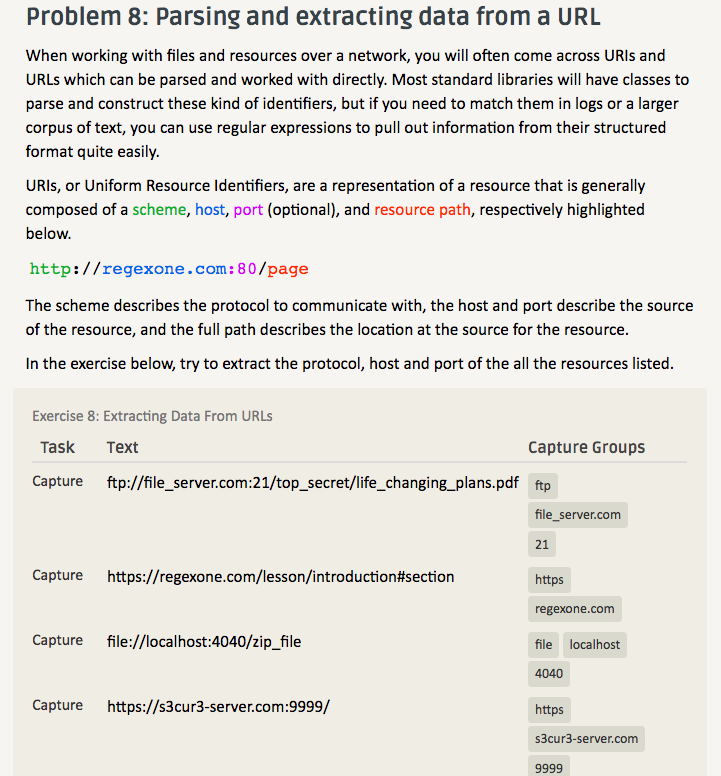

# Lab 01 Report - Introduction to Open Source Software

# READING ASSIGNMENTS

  The 10 criteria of Open Source Definition are important to understand so as to truly make code free to use and colloborate with others. Without these firm rules, it would be easy to unknowningly be penalized under the false assumption that you can modify or derive the work given that you can look at the source code. With these criteria, if something is branded "open-source", one has a firm guarantee that they can play with the code or use it however they want. 

  There are many more ways to answer questions in a helpful way, following up on the ways stated by Eric Raymond. One possible way is to break down the question being asked further, so that it is in several small and simple chunks. That way, the querent will be able to understand the thought process behind solving the problem and use the technique in future ones. A second possible way to answer a question in a helpful way not previously stated is provide a video link to a similar question being solved. While this only applies to general types of questions and not specific ones (such as specific hardware issues), it is a way to provide helpful feedback that already exists on the internet. In some sense, this is a more helpful reply in the vein of "STFW".

  Chapter 3 of Free Culture presented an absurd and disgusting example of a company strong-arming an individual. It brought to light the point that the "we are many; you are few" ideology in these cases severely impacts the fighting power of the smaller party; in this case, Jesse. Dealing with situations like these are always incredibly tough, and as Jesse showed, they often lead into submission to the larger side. Situations like these are why open-source programs are beneficial to all coders. By releasing the restrictions on public code, we would not have to deal with standoffs like the one that occured between RIAA and Jesse. This chapter showed me that not all open code is free to use, so I should be careful to make sure I can. It also highlighted the importance of spreading open-source code as a medium for projects. Doing so brings benefits to every individual, and circumvents issues that may arise with companies. 

# LINUX

# REGEX

# SNAP OR BLOCKLY

# REFLECTION

  In the link provided to aosabook, there are a few projects that may be interesting to evaluate. One such project is VTK, the Visual Toolkit. It is a scientific data visualization system, so it would be interesting to see how they display data, as well as how they handle data given in the first place. I am currently trying to find an open source project that interests me on GitHub. I am using the explore option provided, and browsing through projects tagged with Python. I'm not sure in which direction I would like to go with my open source project, so I am keeping my scope wide. So far, I do know I would like the project to be in Python (hence the tag). That is all for now!
  
  
  
